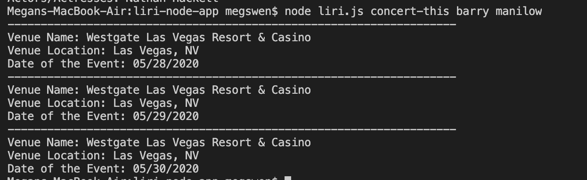

# liri-node-app

# Introduction
LIRI is like iPhone's SIRI. However, while SIRI is a Speech Interpretation and Recognition Interface, LIRI is a Language Interpretation and Recognition Interface. LIRI is a command line node app that takes in parameters and gives you back data.

# Set Up
1. Clone the repository

2. Run npm install, and the following packages should be installed:

    Node-Spotify-API

    Axios

    Moment

    DotEnv

3. Create a .env file in the same directory as the rest of the files. In the .env file should be:

    '# Spotify API keys'

    'SPOTIFY_ID=your-spotify-ID-here'

    'SPOTIFY_SECRET=your-spotify-secret-here'

# LIRI Available Functions
concert-this

spotify-this-song

movie-this

do-what-it-says

# Command: concert-this
$ node liri.js concert-this (band name)

Using the Bands In Town API, this will show the following information about the first three events the user searches for:

    •Name of the Venue

    •Location of the Venue

    •Date of the Event

# Command: spotify-this-song
$ node liri.js spotify-this-song (song name)

Using the Spotify API, this will show the following information about the song the user searches for:

    •Artist

    •Song Name

    •Album of the Song

    •Song Preview Link

If no song is provided, the song "The Sign" will be pulled up instead.

# Command: movie-this
$ node liri.js movie-this (movie name)

Using the OMBD API, this will show the following information about the movie the user searches for:

    •Title of the Movie

    •Year the Movie was Released

    •Director

    •The IMDB Rating

    •Country the Movie was made in

    •Language the Movie is in

    •Plot of the Movie

    •Actors in the Movie

If no movie is provided, the movie "Mr. Nobody." will be pulled up instead.

# Command: do-what-it-says
$ node liri.js do-what-it-says

The program will take the text inside of random.txt and use it to call the first command with the second part as it's parameter.

Currently in random.txt, the following text is there:

spotify-this-song I Want It That Way

This would call the spotify-this-song function and pass in "I Want it That Way" as the song.

# Technologies Used
Javascript

NodeJS

Node packages:

    •Axios

    •Moment

    •DotEnv

APIs used:

    •Bands in Town

    •Node-Spotify-API

    •OMDB